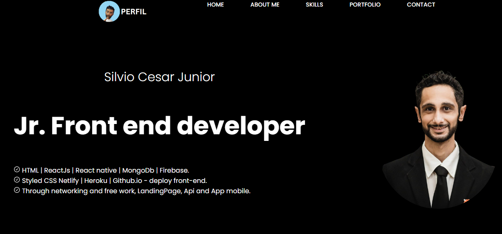

<h1 align="center"> Portfólio Silvio Cesar </h1>

Recebendo constantes atualizações de projetos desenvolvidos e publicados, afim de atrair recrutadores, devs e clientes em potencial.  

  <a href="#-tecnologias">Tecnologias</a>&nbsp;&nbsp;&nbsp;|&nbsp;&nbsp;&nbsp;
  <a href="#-projeto">Projeto</a>&nbsp;&nbsp;&nbsp;|&nbsp;&nbsp;&nbsp;
  <a href="#-layout">Layout</a>&nbsp;&nbsp;&nbsp;|&nbsp;&nbsp;&nbsp;
  

 

  

## 🚀 Tecnologias

Esse projeto foi desenvolvido com as seguintes tecnologias:

- HTML e CSS
- JavaScript / React
- Git e Github
- Canva

## 💻 Projeto

Um portfólio de uso próprio para mostrar todos os projetos, web sites, aplicativos e programas backend desenvolvidos ao longo do período de estudo e trabalhos freelancer.

- [Visite o projeto online](https://silviocesarjunior.netlify.app/)